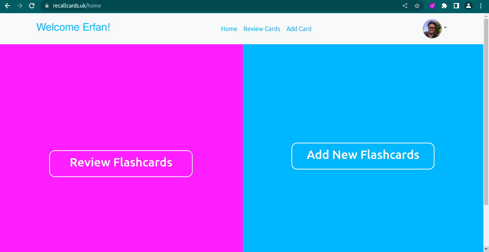
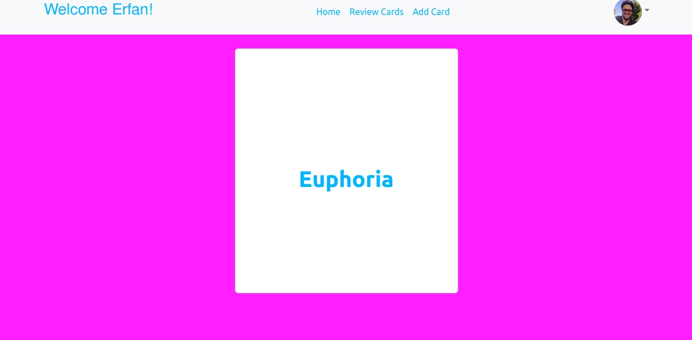
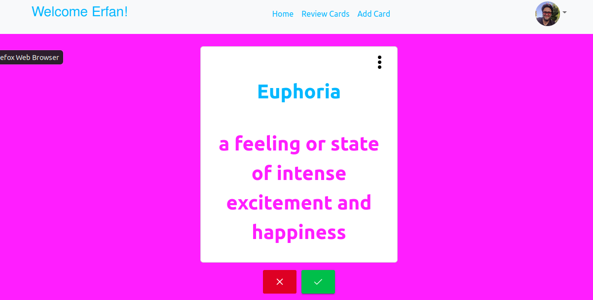

# Flashcard Project 

With React and Typescript, I developed the frontend for my website [recallcards.uk](https://recallcards.uk/).\
You can also view the [Python back-end repository](https://github.com/ErfanTagh/flashcard-backend).\
Feel free to give it a try!\
It's all free, no credit cards required! 

## Project Overview 

The authentication was handled by [Auth0](https://auth0.com).\
You can see the private and public root settings as well as redirect callbacks in the root App.js file.\
The react components can be found in the components folder.\
To make multiple requests to the Rest API, this project uses the JS fetch API. 

## `React Components`

The react components can be found in the components folder.\ 
The folder Auth0 components is related to the Auth0 service, as its name suggests.\
### `MainPage`

The component of the app that the user is redirected to after authentication is the [MainPage Component](https://github.com/ErfanTagh/flashcard-frontend/blob/main/src/Components/MainPage.tsx).\
Here the user can choose between reviewing existing flashcards or adding a new card.\




### `AddFlashcard` 

The [AddFlashcard Component](https://github.com/ErfanTagh/flashcard-frontend/blob/main/src/Components/AddFlashcard.tsx) gets the new key and answer from the user and sends it the api for storing it in the users list of keys and values database.\

The following code in the component sends the entered key and value as a POST request to the "sendwords" endpoint.

```
const handleSubmit = (event) => {
        event.preventDefault();

        const requestOptions = {
            method: 'POST',
            headers: { 'Content-Type': 'application/json' ,'Accept': 'application/json'
            },
            body: JSON.stringify({ token: user.email,word: inputs["title"], ans: inputs["ans"] })
        };
        fetch('/sendwords', requestOptions)
            .then(response =>

                response.json())
            .then(data => {

                console.log(data);

                if(data['status'] === 200){
                    flashref.current.show({severity: 'success', summary: 'Success', detail: 'Word Added Successfully'});
                   
                }

            }


            );

    }

```

If the POST request is successful and a status code of 200 is returned from the server, the app displays a operation successful dialog. Clearing the input box of the name and value after the user submits could be a future improvement.


### `Flashcard`

In this [component](https://github.com/ErfanTagh/flashcard-frontend/blob/main/src/Components/Flashcard.tsx) we show the users flashcards so the user can review.\
After the GET reuqest, we store the users key and answer recieved from the server to the setPlanets (the state name probably has to change!) state.\
This state will be passed through the component [FlashCardItem](https://github.com/ErfanTagh/flashcard-frontend/blob/main/src/Components/FlashCardItem.tsx) to the [FlipCard](https://github.com/ErfanTagh/flashcard-frontend/blob/main/src/Components/FLipCard.tsx) component.\
The reason for all this props passing is because of the flipping animation that gets rendered when the user clicks on the card to see it's answer.\ 

The [DropDown](https://github.com/ErfanTagh/flashcard-frontend/blob/main/src/Components/DropDown.tsx) component is where the user can delete or edit the cards. If the user knows the revealed answer, the green button is pressed but if the answer is not known and requires further reviewing, the red button is clicked and a label 'Reviewing' will be added next time that specific card pops up.





