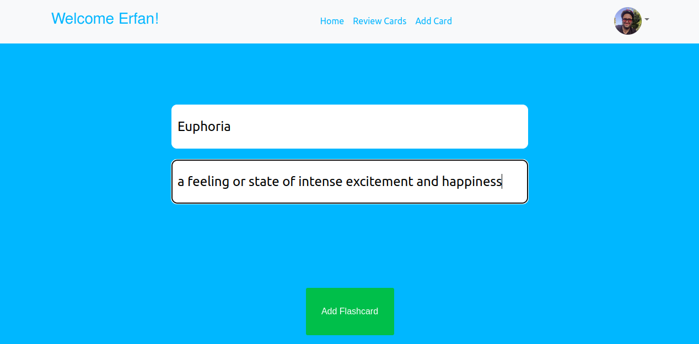

# Flashcard Project 

With React and Typescript, I developed the frontend for my website [recallcards.uk](https://recallcards.uk/).\
You can also view the [Python back-end repository](https://github.com/ErfanTagh/flashcard-backend).\
Feel free to give it a try!\
It's all free, no credit cards required! 

## Project Overview 

The authentication was handled by [Auth0](https://auth0.com).\
You can see the private and public root settings as well as redirect callbacks in the root App.js file.\
The react components can be found in the components folder.\
To make multiple requests to the Rest API, this project uses the JS fetch API. 

## `React Components`

The react components can be found in the components folder.\ 
The folder Auth0 components is related to the Auth0 service, as its name suggests.\
### `MainPage`

After authentication, the user is redirected to the [MainPage Component] (https://github.com/ErfanTagh/flashcard-frontend/blob/main/src/Components/MainPage.tsx).\

Users can review existing flashcards or add new ones here.


### `AddFlashcard` 

Using the [AddFlashCard Component] (https://github.com/ErfanTagh/flashcard-frontend/blob/main/src/Components/AddFlashcard.tsx), the component receives the new key and answer from the user and stores it in the database for that user.\
This component sends the entered key and value to the "sendwords" endpoint as a POST request.

```
const handleSubmit = (event) => {
        event.preventDefault();

        const requestOptions = {
            method: 'POST',
            headers: { 'Content-Type': 'application/json' ,'Accept': 'application/json'
            },
            body: JSON.stringify({ token: user.email,word: inputs["title"], ans: inputs["ans"] })
        };
        fetch('/sendwords', requestOptions)
            .then(response =>

                response.json())
            .then(data => {

                console.log(data);

                if(data['status'] === 200){
                    flashref.current.show({severity: 'success', summary: 'Success', detail: 'Word Added Successfully'});
                   
                }

            }


            );

    }

```

When the POST request is successful and a status code of 200 is returned from the server, the app displays an operation successful dialog.\
A future improvement might be to clear the input box after the user submits the name and value.




### `Flashcard`

We show the users flashcards in this component (https://github.com/ErfanTagh/flashcard-frontend/blob/main/src/Components/Flashcard.tsx) so they can review them.\
Following the GET request, we store the user's key and answer in the setPlanets state (the state name probably needs to change!).\
The state will be passed through the [FlashCardItem](https://github.com/ErfanTagh/flashcard-frontend/blob/main/src/Components/FlashCardItem.tsx) component to the [FlipCard](https://github.com/ErfanTagh/flashcard-frontend/blob/main/src/Components/FLipCard.tsx).\
When the user clicks on a card to see its answer, a flipping animation is rendered, which explains all these props passing.\
The user can delete and edit cards by using the [DropDown] component (https://github.com/ErfanTagh/flashcard-frontend/blob/main/src/Components/DropDown.tsx). A green button is pressed if the user knows the revealed answer; a red button is clicked if the answer is not known and requires further review.


